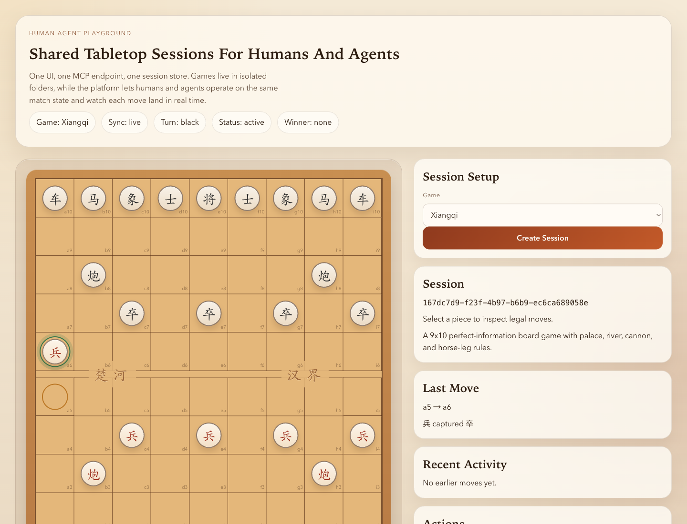

# Human Agent Playground

[中文说明](./README.zh-CN.md)

Human Agent Playground is a TypeScript monorepo for shared board-game sessions between humans and AI agents.

One session can be used from:

- a web UI
- an HTTP API
- an MCP server

Current game: Xiangqi.

## UI Preview



## What It Does

- Keeps one shared game session for both humans and agents
- Updates the web UI live when moves arrive from MCP or HTTP
- Organizes each game under its own folder and adapter
- Exposes MCP over Streamable HTTP

## Quick Start

```bash
npm install
npm run dev:server
npm run dev:web
```

Fixed local ports:

```bash
npm --prefix apps/server run start
npm --prefix apps/web run start
```

Single-command local startup:

```bash
bash scripts/dev.sh
```

Override ports or data path when needed:

```bash
API_PORT=8787 WEB_PORT=4173 HUMAN_AGENT_PLAYGROUND_DATA_PATH=/tmp/hap.json bash scripts/dev.sh
```

Default local endpoints:

- UI: `http://127.0.0.1:4173`
- HTTP API: `http://127.0.0.1:8787/api`
- MCP: `http://127.0.0.1:8787/mcp`
- Health: `http://127.0.0.1:8787/health`

Override with:

- `PORT`
- `HUMAN_AGENT_PLAYGROUND_DATA_PATH`
- `VITE_API_URL`

## How To Play

1. Start the server and web app.
2. Open the UI and click `Create Session`.
3. Select a piece to inspect legal moves.
4. Click a highlighted square to play.
5. Watch the board and message feed update live.

## Human + Agent Shared Play

Humans and agents already play in the same session.

Typical flow:

1. A human creates a session in the UI.
2. An agent connects to MCP and calls `list_sessions`.
3. The agent reads the board with `get_game_state`.
4. The agent checks moves with `xiangqi_get_legal_moves`.
5. The agent plays with `xiangqi_play_move`.
6. The UI updates live through SSE.

## MCP Usage

MCP endpoint:

- `http://127.0.0.1:8787/mcp`

Example client config:

```json
{
  "mcpServers": {
    "human-agent-playground": {
      "type": "streamable-http",
      "url": "http://127.0.0.1:8787/mcp"
    }
  }
}
```

Current MCP tools:

- `list_games`
- `list_sessions`
- `search_tools`
- `create_session`
- `get_game_state`
- `wait_for_turn`
- `xiangqi_get_legal_moves`
- `xiangqi_play_move`
- `xiangqi_play_move_and_wait`
- `reset_session`

Tool metadata now includes category and tags in `tools/list`, and `search_tools` can filter by `query`, `category`, `gameId`, and `tags`.

Recommended tool order:

1. `list_games`
2. `search_tools` when the server exposes many tools
3. `list_sessions` or `create_session`
4. `get_game_state`
5. `xiangqi_get_legal_moves`
6. `xiangqi_play_move_and_wait` for long-running shared play, or `xiangqi_play_move` for single-step control

## Agent Move Rules

When an agent plays through MCP, use this sequence for every move:

1. Read `get_game_state`.
2. If it is not your turn, call `wait_for_turn` once and stop waiting as soon as it returns `ready`.
3. Re-read `get_game_state` after `ready`.
4. Use `xiangqi_get_legal_moves` as the source of truth for legality.
5. For long-running shared play, prefer `xiangqi_play_move_and_wait`.
6. Use `xiangqi_play_move` only when you want low-level single-step control.

Reasoning rules for `xiangqi_play_move` and `xiangqi_play_move_and_wait`:

- `reasoning.summary` must describe why this move was chosen now.
- `reasoning.reasoningSteps` must contain at least one short step about the current position.
- The server stores this reasoning but does not invent it for you.
- Do not reuse stock explanations.
- Do not include a multi-move plan as if it were already decided.
- Do not call `wait_for_turn` again before you either move once or decide to stop.
- IMPORTANT: when `wait_for_turn` returns `ready`, continue with MCP tool calls immediately.
- NEVER send a chat reply before you have either played exactly one move or explicitly decided to stop.

## Turn-Based Shared Play Without External Polling

`wait_for_turn` is the low-level blocking MCP tool for turn-based shared play.

`xiangqi_play_move_and_wait` is the higher-level version for the common case:

- it plays one move now
- it then keeps waiting inside the MCP server while the opponent makes exactly one reply
- it returns only when the turn comes back to the same side, the game finishes, or the timeout expires

Prefer `xiangqi_play_move_and_wait` when one agent is supposed to keep a single long-running MCP task alive across many turns.
If the user asked for a complete game, the agent should keep calling `xiangqi_play_move_and_wait` again immediately after each `ready` result until the status becomes `finished`.

Use it when one side is controlled by a human in the UI and the other side is controlled by an agent in one long-running MCP session.

Recommended flow:

1. Call `get_game_state`.
2. Read the latest `session.events` entry and keep its `id` as `afterEventId`.
3. If it is not the agent's turn yet, call `wait_for_turn` with:
   - `sessionId`
   - `expectedTurn`
   - `afterEventId`
   - `timeoutMs`
4. When `wait_for_turn` returns `status: "ready"`, call `get_game_state` again.
5. Inspect legal moves with `xiangqi_get_legal_moves`.
6. Prefer `xiangqi_play_move_and_wait` with fresh move-specific reasoning.
7. When it returns `ready`, re-read the state and immediately call the next move tool.
8. If the user asked for a full game, keep repeating step 7 until the result becomes `finished`.
9. Use `xiangqi_play_move` only when you need to separate play and wait for debugging or fine-grained control.

Notes:

- `wait_for_turn` waits inside the MCP server. It is meant to replace client-side `sleep` loops.
- `xiangqi_play_move_and_wait` keeps the play-and-wait cycle inside one MCP tool call so the host is less likely to break the loop by replying in chat between turns.
- In practice, one `xiangqi_play_move_and_wait` call means: play one move, wait for the opponent to answer once, then return when it is your turn again.
- This pattern works best in hosts that allow one reply or one task to keep running while it repeatedly calls MCP tools.
- The tool may return:
  - `ready`: the expected side may move now
  - `finished`: the game ended while waiting
  - `timeout`: no matching turn arrived before the timeout

## Repo Layout

```text
apps/
  server/          HTTP API + MCP server
  web/             React + Vite UI
packages/
  core/            shared session contracts
games/
  xiangqi/         Xiangqi rules, state, adapter, tests
docs/
  ARCHITECTURE.md  platform notes
skills/
  human-agent-playground-mcp/
```

## Validation

```bash
npm test
npm run check
npm run build
```

## More

- Architecture: [docs/ARCHITECTURE.md](./docs/ARCHITECTURE.md)
- Agent skill: [skills/human-agent-playground-mcp/SKILL.md](./skills/human-agent-playground-mcp/SKILL.md)
