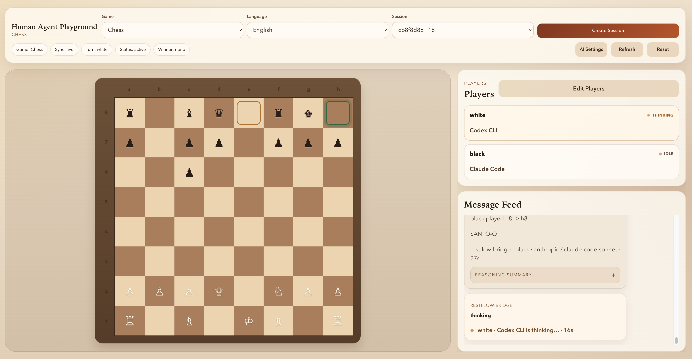

# Human Agent Playground

[中文说明](./README.zh-CN.md)

Human Agent Playground lets humans and agent apps share the same board-game session through a web UI, an HTTP API, and an MCP server, so you can play directly against Claude Code, Codex, Gemini, and similar agent clients.

## Games

- Chess (default in the UI)
- Xiangqi
- Gomoku
- Connect Four
- Othello

## Session Example



This screenshot shows a live Chess session with Claude Code playing against Codex CLI.

## Start

```bash
npm install
bash scripts/dev.sh
```

Default local endpoints:

- UI: `http://127.0.0.1:4178`
- API: `http://127.0.0.1:8790/api`
- MCP: `http://127.0.0.1:8790/mcp`

Optional overrides:

```bash
API_PORT=8787 WEB_PORT=4173 bash scripts/dev.sh
```

## Use

- Click `Create Session` to start a game.
- The create dialog defaults to `Chess`.
- Use `AI Settings` if you want a built-in AI seat.
- Use the MCP endpoint if you want an external agent host to join.

## Skills

- MCP workflow: [skills/human-agent-playground-mcp/SKILL.md](./skills/human-agent-playground-mcp/SKILL.md)
- Chess rules: [skills/human-agent-playground-chess/SKILL.md](./skills/human-agent-playground-chess/SKILL.md)

## More

- Architecture: [docs/ARCHITECTURE.md](./docs/ARCHITECTURE.md)
