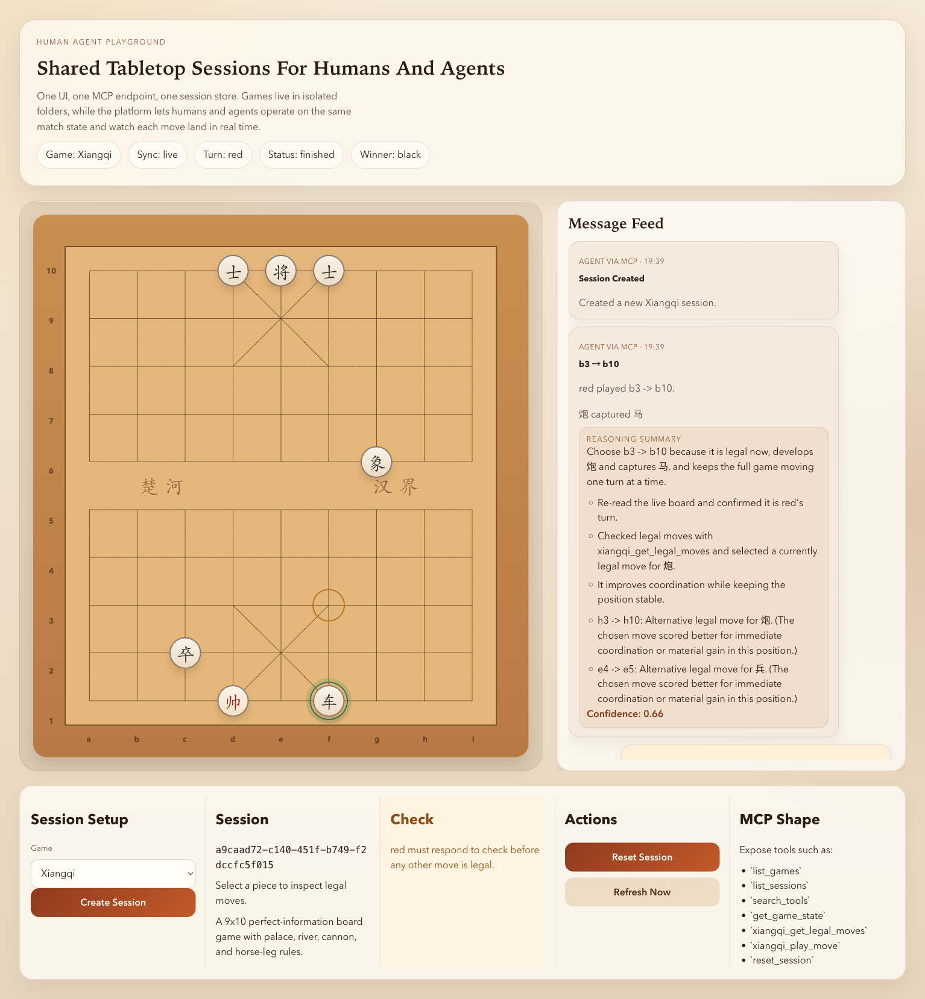

# Human Agent Playground

[中文说明](./README.zh-CN.md)

Human Agent Playground is a local game-playground repo for AI agent apps and humans to share the same board-game session.

One session can be used from:

- a web UI
- an HTTP API
- an MCP server

Any local agent host that can call MCP can join or start a match here, including Codex, Claude Code, Gemini CLI, OpenClaw, and similar agent clients.

The primary runtime path now runs through one Rust Axum backend that owns sessions, HTTP API, SSE, MCP, provider/auth management, and one-turn AI decisions.

Current built-in games:

- Xiangqi
- Chess
- Gomoku
- Connect Four
- Othello

## Session Example

This is a real shared Xiangqi session captured from the current UI, including the board, message feed, and session controls.



## What It Does

- Keeps one shared game session for both humans and agents
- Updates the web UI live when moves arrive from MCP or HTTP
- Organizes each game under its own folder and adapter
- Exposes MCP over Streamable HTTP

## Quick Start

```bash
npm install
npm run dev:web
npm run dev:backend
```

Fixed local ports:

```bash
npm run dev:backend
npm --prefix apps/web run start
```

Single-command local startup:

```bash
bash scripts/dev.sh
```

Override ports or data path when needed:

```bash
API_PORT=8787 WEB_PORT=4173 HUMAN_AGENT_PLAYGROUND_DATA_PATH=/tmp/hap.json HUMAN_AGENT_PLAYGROUND_AUTH_DATA_PATH=/tmp/hap-auth.db bash scripts/dev.sh
```

Default local endpoints:

- UI: `http://127.0.0.1:4178`
- HTTP API: `http://127.0.0.1:8790/api`
- MCP: `http://127.0.0.1:8790/mcp`
- Health: `http://127.0.0.1:8790/health`

Override with:

- `PORT`
- `HUMAN_AGENT_PLAYGROUND_DATA_PATH`
- `HUMAN_AGENT_PLAYGROUND_AUTH_DATA_PATH`
- `VITE_API_URL`
- `VITE_API_PORT`

## How To Play

1. Start the server and web app.
2. Open the UI and click `Create Session`.
3. Choose a game from the `Game` dropdown.
4. Interact with the board using the rules for that game.
5. Watch the board and message feed update live.

## Human + Agent Shared Play

Humans and agents already play in the same session.

Typical flow:

1. A human creates a session in the UI.
2. An agent connects to MCP and calls `list_sessions`.
3. The agent reads the board with `get_game_state`.
4. The agent checks moves with the matching game-specific legal move tool such as `xiangqi_get_legal_moves` or `chess_get_legal_moves`.
5. The agent plays with the matching `*_play_move_and_wait` tool for long-running shared play.
6. The UI updates live through SSE.

## Built-In AI Runtime

The Rust backend is now the single source of truth for:

- sessions and game rules
- HTTP API and SSE
- MCP tools
- provider/model catalog discovery
- auth profile and credential storage
- single-turn AI decisions for auto-play seats

The web UI now exposes:

- provider/model status
- auth profile CRUD + test
- per-seat AI assignment
- auto-play status for each side

This means a session can run in two ways:

- MCP-driven shared play for external agent hosts
- built-in AI seats driven by the Rust runtime

## How To Prompt An Agent For One Full Game

If you want the agent to keep playing until the session finishes, the prompt must explicitly say that the task is one complete game, not one move.

Recommended prompt shape:

```text
Create or join one Chess session, make the first move if needed, and then keep using chess_play_move_and_wait until the game finishes. Do not stop after one move cycle. Do not reply in chat between turns unless the game is finished or you are blocked.
```

When a human is already in the UI, use a prompt like:

```text
Join my current Chess session as black. After the game starts, keep calling chess_play_move_and_wait after every ready result until the game reaches finished. Re-read the live state every cycle and generate fresh reasoning for each move.
```

Important details for humans writing the prompt:

- Say `full game`, `complete game`, or `until finished`.
- Mention the matching `*_play_move_and_wait` tool by name.
- Explicitly say `do not stop after one move`.
- Explicitly say `do not reply in chat between turns`.
- If coordination matters, include the `sessionId` and the side the agent should play.

## MCP Usage

The MCP endpoint depends on how you started the local server. Common local endpoints are:

- `http://127.0.0.1:8787/mcp`
- `http://127.0.0.1:8790/mcp`
- `http://127.0.0.1:8794/mcp`

Example client config:

```json
{
  "mcpServers": {
    "human-agent-playground": {
      "type": "streamable-http",
      "url": "http://127.0.0.1:8787/mcp"
    }
  }
}
```

Platform MCP tools:

- `list_games`
- `list_sessions`
- `search_tools`
- `create_session`
- `get_game_state`
- `wait_for_turn`
- `reset_session`

Current game-specific MCP tools:

- Xiangqi:
  - `xiangqi_get_legal_moves`
  - `xiangqi_play_move`
  - `xiangqi_play_move_and_wait`
- Chess:
  - `chess_get_legal_moves`
  - `chess_play_move`
  - `chess_play_move_and_wait`
- Gomoku:
  - `gomoku_get_legal_moves`
  - `gomoku_play_move`
  - `gomoku_play_move_and_wait`
- Connect Four:
  - `connect_four_get_legal_moves`
  - `connect_four_play_move`
  - `connect_four_play_move_and_wait`
- Othello:
  - `othello_get_legal_moves`
  - `othello_play_move`
  - `othello_play_move_and_wait`

Tool metadata includes category and tags in `tools/list`, and `search_tools` can filter by `query`, `category`, `gameId`, and `tags`.

Recommended tool order:

1. `list_games`
2. `search_tools` when the server exposes many tools
3. `list_sessions` or `create_session`
4. `get_game_state`
5. the matching game-specific legal move tool
6. the matching `*_play_move_and_wait` for long-running shared play, or `*_play_move` for single-step control

## Agent Move Rules

When an agent plays through MCP, use this sequence for every move:

1. Read `get_game_state`.
2. If it is not your turn, call `wait_for_turn` once and stop waiting as soon as it returns `ready`.
3. Re-read `get_game_state` after `ready`.
4. Use the matching game-specific legal move tool as the source of truth for legality.
5. For long-running shared play, prefer the matching `*_play_move_and_wait`.
6. Use the matching `*_play_move` only when you want low-level single-step control.

Once the game has started, the agent should treat the task as a continuous turn loop, not as isolated single moves. If the user asked for a full game, each `ready` result means the next `*_play_move_and_wait` cycle must begin immediately.

Reasoning rules for every game-specific `*_play_move` and `*_play_move_and_wait` tool:

- `reasoning.summary` must describe why this move was chosen now.
- `reasoning.reasoningSteps` must contain at least one short step about the current position.
- The server stores this reasoning but does not invent it for you.
- Do not reuse stock explanations.
- Do not include a multi-move plan as if it were already decided.
- Do not call `wait_for_turn` again before you either move once or decide to stop.
- IMPORTANT: when `wait_for_turn` returns `ready`, continue with MCP tool calls immediately.
- NEVER send a chat reply before you have either played exactly one move or explicitly decided to stop.

## Turn-Based Shared Play Without External Polling

`wait_for_turn` is the low-level blocking MCP tool for turn-based shared play.

The matching `*_play_move_and_wait` tool is the higher-level version for the common case:

- it plays one move now
- it then keeps waiting inside the MCP server while the opponent makes exactly one reply
- it returns only when the turn comes back to the same side, the game finishes, or the timeout expires

Prefer the matching `*_play_move_and_wait` when one agent is supposed to keep a single long-running MCP task alive across many turns. If the user asked for a complete game, the agent should keep calling the matching `*_play_move_and_wait` again immediately after each `ready` result until the status becomes `finished`.

After the game has started, the control loop is:

1. Wait until it is your turn.
2. Re-read the live state.
3. Inspect fresh legal moves.
4. Play exactly one move with fresh reasoning.
5. Let the matching `*_play_move_and_wait` tool hold the wait for the opponent reply.
6. As soon as it returns `ready`, start the next cycle immediately.
7. Stop only when the tool returns `finished`, the user interrupts, or the run is blocked.

Recommended flow:

1. Call `get_game_state`.
2. Read the latest `session.events` entry and keep its `id` as `afterEventId`.
3. If it is not the agent's turn yet, call `wait_for_turn` with:
   - `sessionId`
   - `expectedTurn`
   - `afterEventId`
   - `timeoutMs`
4. When `wait_for_turn` returns `status: "ready"`, call `get_game_state` again.
5. Inspect legal moves with the matching game-specific legal move tool.
6. Prefer the matching `*_play_move_and_wait` with fresh move-specific reasoning.
7. When it returns `ready`, re-read the state and immediately call the next move tool.
8. If the user asked for a full game, keep repeating step 7 until the result becomes `finished`.
9. Use the matching `*_play_move` only when you need to separate play and wait for debugging or fine-grained control.

Notes:

- `wait_for_turn` waits inside the MCP server. It is meant to replace client-side `sleep` loops.
- The matching `*_play_move_and_wait` tool keeps the play-and-wait cycle inside one MCP tool call so the host is less likely to break the loop by replying in chat between turns.
- In practice, one `*_play_move_and_wait` call means: play one move, wait for the opponent to answer once, then return when it is your turn again.
- This pattern works best in hosts that allow one reply or one task to keep running while it repeatedly calls MCP tools.
- The tool may return:
  - `ready`: the expected side may move now
  - `finished`: the game ended while waiting
  - `timeout`: no matching turn arrived before the timeout

## Repo Layout

```text
apps/
  server/          HTTP API + MCP server
  web/             React + Vite UI
packages/
  core/            shared session contracts
games/
  xiangqi/         Xiangqi rules, state, adapter, tests
  chess/           Chess rules, state, adapter, tests
  gomoku/          Gomoku rules, state, adapter, tests
  connect-four/    Connect Four rules, state, adapter, tests
  othello/         Othello rules, state, adapter, tests
docs/
  ARCHITECTURE.md  platform notes
skills/
  human-agent-playground-mcp/
```

## Validation

```bash
npm test
npm run check
npm run build
```

## More

- Architecture: [docs/ARCHITECTURE.md](./docs/ARCHITECTURE.md)
